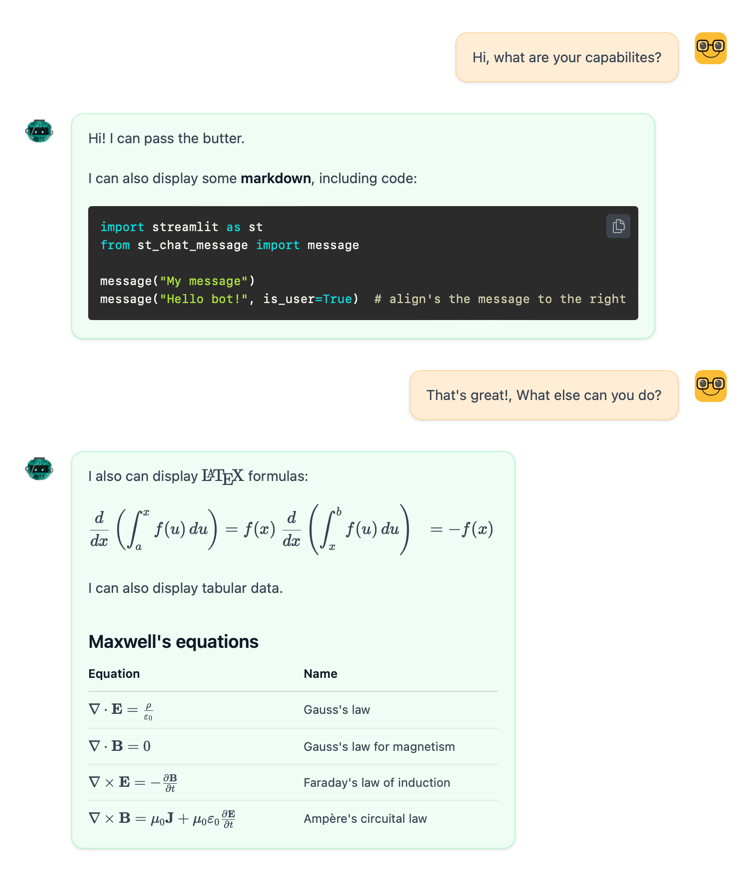

# st-chat-message

## Description

This is a simple chat message component for streamlit. It is based on the [streamlit-chat](https://github.com/AI-Yash/st-chat) component, trying to be as compatible as possible, but it adding a few features:

- Markdown support
- LaTeX support
- Tables

## Installation

```bash
pip install st-chat-message
```

or

```bash
poetry add st-chat-message
```
## Usage

```python
import streamlit as st
from st_chat_message import message

message("Hello world!", is_user=True)
message("Hi")
```



## Streaming (docs-style)

Use the `message_stream` helper to stream text as it arrives. It updates a single message in-place using a stable `key`, similar to the Streamlit docs examples.

```python
from st_chat_message import message_stream

# chunks can be any iterable of text deltas
final_text = message_stream(
    chunks,
    is_user=False,
    key="assistant_stream",
    rich_content=True,   # set False for fastest updates
    throttle_ms=25,      # minimum ms between UI updates
    flush_every=1,       # emit every N chunks
)
```

- **rich_content**: when True (default), renders Markdown (LaTeX, tables, code). Set to False for faster re-renders while streaming.
- The final full text is returned once the stream finishes.

See `examples/generator_streaming.py` for a simple generator-based demo, and `examples/openai_streaming.py` for OpenAI streaming.

## Buiding from source

### Prerequisites

- nodejs >= 18.x
- yarn >= 1.22.x
- poetry >= 1.2.x
- python >= 3.8.x

### Building

```bash
./build.sh
```

### Publishing

```bash
poetry publish 
```


## License

This project is licensed under the MIT License - see the [LICENSE](LICENSE) file for details
